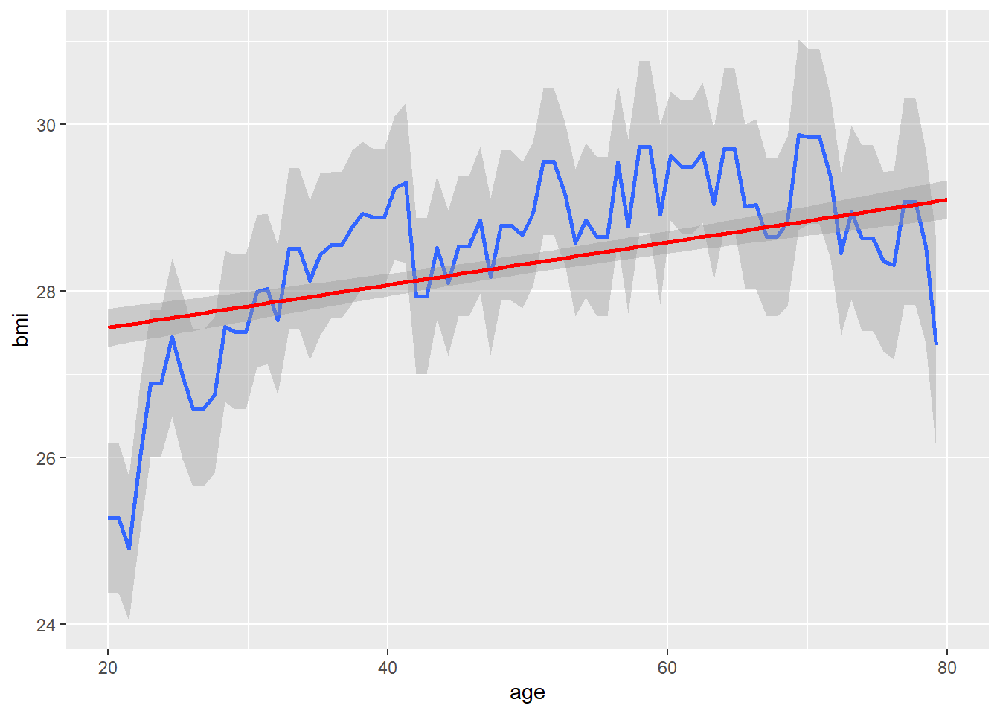
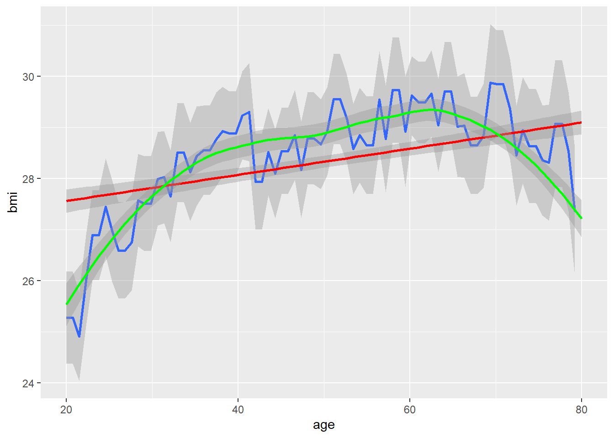

**Visualisation of non-linear modelling**
=========================================
<style>div.blue { background-color:#e6f0ff; border-radius: 5px; padding: 20px;}</style>
<style>div.gray { color:darkgray; }</style>
<style>div.figure { float: center; width: 75%; }</style>

```{r packages, echo = FALSE, warning = FALSE, message = FALSE}
library(mfp)
library(ggplot2)
library(splines)
library(ggpubr)
```

<center><div class = "gray">*by Daniela Dunkler and Georg Heinze*</div></center>


<br>

## Goal of this shiny application
For eleven different explanatory variables, the user can visualise non-linear effects applying **fractional polynomials**, **natural (restricted cubic) splines**, or **linear B-splines**. For each method, the relevant parameters can be changed and the resulting non-linear effect can be graphically assessed. 

Users can visualise first- or second-degree fractional polynomials, linear B-splines with 4 degrees of freedom and natural splines with 3 degrees of freedom. Additionally, if one assumes a specific residual standard error, one can visualise how the outcome $y$ could look like. *Are these data realistic in a biomedical setting?*

<br>
               
## Data used in this app
The data used to visualise non-linear modelling stem from the [National Health and Nutrition Helath Survey (NHANES)](<https://www.cdc.gov/nchs/nhanes/index.htm>) from the waves 2007-2008 and 2009-2010. For each variable used in this application one thousand men and women were randomly selected.
               
***

<br>

## **Modelling non-linear effects**

<br>

### 1. The linearity assumption

Recall the definition of a linear regression model $$y = \beta_0 + \beta_1 x + \epsilon,$$ 

where $y$ is the outcome, $\beta_0$ the intercept, $\beta_1$ the regression coefficient of the explanatory variable $x$ and $\epsilon$ as the error term of the model. The linear regression model is equivalent to $$E(Y) = \beta_0 + \beta_1 x$$ with $E(Y)$ being the expected value of $y$.

<br>

<div class = "blue">The linearity assumption states that with each one-unit difference in $x$, there should be a $\beta_1$ difference in $y$.</div>

<br>

Put mathematically, $\partial E(Y) / \partial x = \partial (\beta_0 + \beta_1 x)/\partial x = \beta_1$.

<br>

*But what actually happens if this assumption is violated?* 

<div class = "blue">A violation of the linearity assumption would imply that in different regions of $x$ the impact of $x$ is not $\beta_1$, but larger or smaller than on average. This means that inclusion of $x$ as a single explanatory variable is not sufficient to model the association with $y$.</div>

<br>

In medical applications, the linearity assumption is frequently violated. To illustrate this possibility, let us consider a data set with age and body-mass-index (BMI) of 9377 NHANES participants. Below, is a plot of BMI values against age with the mean BMI values computed at each age (blue line). Additionally, the model assuming a linear association is added in red.

```{r age_bmi_1_plot, echo = FALSE, warning =  FALSE}
explanation_data <- readRDS(file = "./data/explanation_data.rds")

ggplot(explanation_data, aes(age, bmi)) + geom_smooth(method="lm", formula=y ~ cut(x, breaks=seq(19.9, 80.1))) + geom_smooth(method="lm", formula=y ~ x, colour = "red")
```
<br><br>

<!---<center><div class = "figure"></div></center>-->
The association between BMI and age is obviously not linear. The question is are differences in BMI between adjacent age groups due to a trend in the population or just due to random variation. 

A popular nonparametric method to ‘smooth’ the blue curve by ‘local regression’ is the method of ‘locally estimated scatterplot smoothing’ (LOESS) (green line). In our case, it gives:

```{r age_bmi_2_plot, echo = FALSE, warning =  FALSE}
ggplot(explanation_data, aes(age, bmi)) + geom_smooth(method = "lm", formula = y ~ cut(x, breaks=seq(19.9, 80.1))) + geom_smooth(method = "lm", formula = y ~ x, colour = "red") + geom_smooth(method = "loess", formula = y ~ x, colour = "green") 
```
<br><br>

<!---<center><div class = "figure"></div></center>-->

In estimating the LOESS line, R automates some of the decisions, e.g., how complex the underlying model should be and how 'wiggly' the resulting curve may be. These decisions are not transparent and therefore, the use of LOESS is more or less restricted to graphical, explorative analyses where trends should be discovered. 

**For modelling purposes, it is advisable that the analyst takes full control over the complexity of the model.** In this way, the analyst can find the right balance between *flexibility* and *stability* of a model.

* Flexibility of a model makes sure that important features of the data are not overlooked. However, if a model is too flexible, it may follow each little 'hub' or 'bump' and lead to increased variance. See the mean-by-age plot above.

* Stability of a model guarantees that the main conclusions from the analysis do not change if the data are slightly changed (e.g., some observations are removed or added). Simpler models, i.e., models with fewer parameters, are usually more stable than more complex models. However, simpler models bear the risk of *misspecification*, meaning that there are systematic trends in the residuals which, if not corrected, lead to misconclusions.

With very large data sets, one can usually reach stability also with a highly flexible modelling approach. In small-to-moderately sized data sets, a data analyst must find the right balance between a flexible and a stable model. Instability can also pose a problem with big data sets, as with the number of observations usually also the number of variables and the number of research questions increases.

In the example above, we see a lot of sudden differences in expected BMI with age changing by one year. Many of these changes are not plausibly explained by underlying population trends. Therefore, the task of the analyst is to separate *systematic* from *random* variation in BMI according to age.

<br>

### 2. Relaxing the linearity assumption

If the association between the explanatory variable $x$ and the outcome $y$ is obviously not linear, one can relax the linearity assumption. The above mentioned model can be extended to accommodate non-linear effects using polynomials. A polynomial of a continuous variable $x$ of degree $k$ is defined as $x, x^2, \ldots, x^k$. If such a polynomial of degree $k$ is used to represent the variable in a regression model, then for each term of the polynomial a separate regression coefficient is estimated. The dependent variable is modeled by $$E(Y) = \beta_0 + \beta_1 x + \beta_2 x^2 + \ldots + \beta_k x^k.$$ 
$x$ (=$x^1$), $x^2$ to $x^k$ are called base functions of $x$. For a raw polynomial of order $3$ of a variable $x$, the base functions can be computed by, e.g.:

|   Variable value $x$  |  $x^1$  |  $x^2$  |  $x^3$ |
|:---------------------:|:--------:|:-------:|:--------:|
|1 | 1 | 1 | 1 |
|2 | 2 | 4 | 8 |
|3 | 3 | 9 | 27 
|... | ... | ... | ... |

In R the `poly()` function is a convenient way to compute polynomial terms. 

Even with $k$ chosen as 2 or 3, such a model is flexible enough to relax the linearity assumption, i.e., the assumption that each increase in $x$ is associated with a difference in $y$ of $\beta_1$. Note, the regression model described above is still a linear model, despite that it provides a non-linear function of the explanatory variable $x$.


In the last decades, a couple of techniques were developed that allow in very flexible ways to relax the linearity assumption. Among them are **fractional polynomials**, and various types of 'splines', like **natural (restricted cubic) splines** or **B-splines**. The use of these methods allow investigation of non-linear effects of continuous variables. In all these proposals, the continuous variable $x$ is first transformed into a few base functions, and the base functions are then used for modelling. 

<br>

#### 2.1. Fractional polynomials

Fractional polynomials select one or two base functions from a predefined catalogue of eight possible transformations, which is:

$$\{x^{-2}, x^{-1}, x^{-1/2}, log(x), x^{1/2}, x, x^{2}, x^{3}\}.$$ 

The so-called 'powers' ($-2, -1, ..., 3$) in those transformations are selected by using those one or two transformations that yield the best model fit. Models requiring one power are called first-degree (FP1) function and models requiring two powers are second-degree (FP2) functions. If the same power is selected twice (i.e., ‘repeated powers’), e.g. $x^{2}$ is selected twice, the FP2 function is defined as $\beta_1 x^{2} + \beta_2 log(x)$. This defines 8 FP1 and 36 FP2 models. These 44 models are sufficient for most biomedical applications as they include very different types of non-linear functions. 

A suitable pretransformation is applied to make the base functions independent, but for pragmatic reasons the pretransformation of $x$ will only shift the values to the positive range (if necessary) and then divide them by a multiple of 10. In this way, the pretransformation stays simple enough to be written down in a report.  

To select the best model among those 44 candidates, a closed testing procedure, called the function selection procedure (FSP) has been introduced:

1. *Test of overall association of the outcome $y$ with $x$*: The best-fitting FP2 model for $x$ at the $\alpha$ level is tested against a model without $x$ (using four degrees of freedom). If the test is not significant, stop, concluding that $x$ is not significant at $\alpha$. $x$ is not included in the final model. Otherwise continue.
2. *Test the evidence of non-linearity*: The best-fitting FP2 model for $x$ is tested against a straight line (linear function) at the $\alpha$ level (using three degrees of freedom). If the test is not significant, stop, concluding that the linear function of $x$ is sufficient. Otherwise continue.
3. *Test between a simple or a more complex non-linear model*: The best-fitting FP2 model for $x$ is tested against the best-fitting FP1 model at the $\alpha$ level (using two degrees of freedom). If the test is not significant, the final model includes the best-fitting FP1 function, otherwise the final model includes the best-fitting FP2 function. 

This procedure preserves the overall (i.e. familywise) type I error probability at a chosen $\alpha$ level. A typical choice for the nominal $p$-value is $\alpha = 0.05$.

The approach is implemented in the R package `mfp`, in which it can be combined with variable selection and used with continuous, binary or time-to-event outcome variables. Using this R package to model the association of BMI on age in our example gives the following fit:

```{r mfp_results, echo = FALSE, warning = FALSE}
fpfit <- mfp(bmi ~ fp(age), family = "gaussian", data = explanation_data)
summary(fpfit)
```

The pretransformation of age includes a division by 100. The powers 0 and 3 are selected leading to the FP2 functions $log((age/100)) + (age/100)^3$. The fitted model looks like this:

```{r mfp_fit, echo = FALSE, warning =  FALSE}
ggplot(explanation_data, aes(age, bmi)) + geom_smooth(method = "lm", formula = y ~ cut(x, breaks = seq(19.5, 80.5))) + geom_smooth(method = "lm", formula = y ~ log(x/100) + I((x/100)^3), colour = "orange")
```

For more information on fractional polynomials we refer to the [multivariable fractional polynomials website](<http://mfp.imbi.uni-freiburg.de/fp>).

<br>

#### 2.2. Splines
Splines are a common method of modelling nonlinear effects of continuous variables. A spline function is defined by a set of piecewise polynomial functions of a continuous variable that are joined smoothly at a set of knots. 

In [Perperoglou A, Sauerbrei W, Abrahamowicz M, Schmid M. BMC Med Res Methodol. 2019](<https://bmcmedresmethodol.biomedcentral.com/articles/10.1186/s12874-019-0666-3/>) the idea of splines is very eloquently explained as: 
*The term ‘spline’ refers to a craftsman’s tool, a flexible thin strip of wood or metal, used to draft smooth curves. Several weights would be applied on various positions so the strip would bend according to their number and position. This would be forced to pass through a set of fixed points: metal pins, the ribs of a boat, etc. On a flat surface these were often weights with an attached hook and thus easy to manipulate. The shape of the bended material would naturally take the form of a spline curve. Similarly, splines are used in statistics in order to mathematically reproduce flexible shapes. Knots are placed at several places within the data range, to identify the points where adjacent functional pieces join each other. Instead of metal or wood stripes, smooth functional pieces (usually low-order polynomials) are chosen to fit the data between two consecutive knots. The type of polynomial and the number and placement of knots is what then defines the type of spline.*

[The above mentioned paper](<https://bmcmedresmethodol.biomedcentral.com/articles/10.1186/s12874-019-0666-3/>) also includes a simple-to-read review of splines methodology and splines functions procedures in R.

<br>

##### 2.2.1. Linear B-splines

A B-spline of order $n$ is a piecewise polynomial function of degree $n-1$ in a variable $x$. It is defined over $n+1$ knots $t_{j}$, which must be in non-descending order $t_{j}<t_{j+1}$. B-splines transform the original variable $x$ into base functions which are greater than 0 for specific subranges of $x$ and 0 otherwise. The number of degrees of freedom defines the number of base functions, and the degree defines the type of transformation. Linear B-splines have degree 1. The subranges are defined by the location of knots. These are usually set automatically, but are part of the definition of the spline transformation.

For example, linear B-splines with three base functions (i.e., `degree=1` and `df=3`) as functions of age look like this 

```{r illu_bsplines_linear, echo = FALSE, warning =  FALSE}
a <- sort(explanation_data$age)
df <- 3
bspl <- bs(a, degree = 1, df = df)

plot(a, bspl[, 1], type = "l", xlab = "age", ylab = "Base functions", ylim = c(0, 1.1 + df/9))
for(i in 2:df) lines(a, bspl[, i], lty = i)
legend("topleft", lty = 1:df, legend = paste("Base function", 1:df), inset = 0.02, bty = "n")
title(main="B-splines of degree 1")
```

In contrast cubic B-splines with three base functions (i.e., `degree=3` and `df=3`) as functions of age look like this:
```{r illu_bsplines_cubic, echo = FALSE, warning =  FALSE}
bspc <- bs(a, degree = 3, df = df)
plot(a, bspc[, 1], type = "l", xlab = "age", ylab = "Base functions", ylim = c(0, 1.1 + df/9))
for(i in 2:df) lines(a, bspc[, i], lty = i)
legend("topleft", lty = 1:df, legend = paste("Base function", 1:df), inset = 0.02, bty = "n")
title(main="B-splines of degree 3")
```

The individual spline bases have no simple interpretation and can only be used together as a set of independent variables representing variable $x$ (here age) in a regression model. In our example, by representing age in several transformations, we can estimate a nonlinear association of BMI with age.

Note, different choices of the number of degrees of freedom and the degree will lead to different model fits. Hence, both parameters have to be carefully selected by the analyst.

Let's see splines in action. We refit the model with BMI and age, now using B-splines to model age. Applying linear B-splines with three base functions (`degree=1` and `df=3`) creates the following fit:

```{r bplines_fit1, echo = FALSE, warning =  FALSE}
# Linear B-splines with df = 3
ggplot(explanation_data, aes(age, bmi)) + geom_smooth(method="lm", formula=y ~ cut(x, breaks = seq(19.9, 80.1))) + geom_smooth(method="lm", formula = y ~ bs(x, degree = 1, df = 3), colour = "red") 
```

A smoother function can be obtained by using cubic B-splines with three base functions (`degree=3` and `df=3`):

```{r bplines_fit2, echo = FALSE, warning =  FALSE}
# Cubic B-splines with df = 3
ggplot(explanation_data, aes(age, bmi)) + geom_smooth(method = "lm", formula = y ~ cut(x, breaks = seq(19.9, 80.1))) + geom_smooth(method = "lm", formula = y ~ bs(x, degree = 3, df = 3), colour = "red") 
```

Increasing the number of degrees of freedom leads to a more 'wiggly" fit. The plots below show linear B-splines with 5, 10, 15, and 20 base functions:

```{r bplines_fit3, echo = FALSE, warning =  FALSE}
pbspl1 <- ggplot(explanation_data, aes(age, bmi)) + geom_smooth(method = "lm", formula = y ~ cut(x, breaks = seq(19.9, 80.1))) + geom_smooth(method = "lm", formula = y ~ bs(x, degree = 1, df = 5), colour = "red") + annotate(geom = "text", x = 65.5, y = 25.6, label = "df = 5")
pbspl2 <- ggplot(explanation_data, aes(age, bmi)) + geom_smooth(method = "lm", formula = y ~ cut(x, breaks = seq(19.9, 80.1))) + geom_smooth(method = "lm", formula = y ~ bs(x, degree = 1, df = 10), colour = "red") + annotate(geom = "text", x = 65.5, y = 25.6, label = "df = 10")
pbspl3 <- ggplot(explanation_data, aes(age, bmi)) + geom_smooth(method = "lm", formula = y ~ cut(x, breaks = seq(19.9, 80.1))) + geom_smooth(method = "lm", formula = y ~ bs(x, degree = 1, df = 15), colour = "red") + annotate(geom = "text", x = 65.5, y = 25.6, label = "df = 15")
pbspl4 <- ggplot(explanation_data, aes(age, bmi)) + geom_smooth(method = "lm", formula = y ~ cut(x, breaks = seq(19.9, 80.1))) + geom_smooth(method = "lm", formula = y ~ bs(x, degree = 1, df = 20), colour = "red") + annotate(geom = "text", x = 65.5, y = 25.6, label = "df = 20")

ggarrange(pbspl1, pbspl2, pbspl3, pbspl4, ncol = 2, nrow = 2)
```

The plots below show cubic B-splines with 5, 10, 15, and 20 base functions:

```{r bplines_fit4, echo = FALSE, warning =  FALSE}
pbspc1 <- ggplot(explanation_data, aes(age, bmi)) + geom_smooth(method = "lm", formula = y ~ cut(x, breaks = seq(19.9, 80.1))) + geom_smooth(method = "lm", formula = y ~ bs(x, degree = 3, df = 5), colour = "red") + annotate(geom = "text", x = 65.5, y = 25.6, label = "df = 5")
pbspc2 <- ggplot(explanation_data, aes(age, bmi)) + geom_smooth(method = "lm", formula = y ~ cut(x, breaks = seq(19.9, 80.1))) + geom_smooth(method = "lm", formula = y ~ bs(x, degree = 3, df = 10), colour = "red") + annotate(geom = "text", x = 65.5, y = 25.6, label = "df = 10")
pbspc3 <- ggplot(explanation_data, aes(age, bmi)) + geom_smooth(method = "lm", formula = y ~ cut(x, breaks = seq(19.9, 80.1))) + geom_smooth(method = "lm", formula = y ~ bs(x, degree = 3, df = 15), colour = "red") + annotate(geom = "text", x = 65.5, y = 25.6, label = "df = 15")
pbspc4 <- ggplot(explanation_data, aes(age, bmi)) + geom_smooth(method = "lm", formula = y ~ cut(x, breaks = seq(19.9, 80.1))) + geom_smooth(method = "lm", formula = y ~ bs(x, degree = 3, df = 20), colour = "red") + annotate(geom = "text", x = 65.5, y = 25.6, label = "df = 20")

ggarrange(pbspc1, pbspc2, pbspc3, pbspc4, ncol = 2, nrow = 2)
```
<br><br>

##### 2.2.2. Restricted (natural) cubic splines

Restricted cubic splines (also known as natural splines) are cubic transformations (i.e., third-order polynomials) of the explanatory variable $x$ in the interior of its range (within the outermost knots), and are linear at the edges (outside the outermost knots). Typically, a small number of knots (e.g., 3 to 5) is sufficient to model most data in biomedical applications. Knots are located at various percentiles of $x$. For example, Frank Harrell recommends in his book[^1] the following settings:

| number of knots  | percentiles |
|:----------------:|:------------:|
3 | 0.10  0.5  0.90 |
4 | 0.05  0.35  0.65  0.95 |
5 | 0.05  0.275  0.5  0.725  0.95 |

With three degrees of freedom (= three transformations) their basis functions would look as follows:
```{r illu_rcs, echo = FALSE, warning =  FALSE}
nspl <- ns(a, df = df)
plot(a, nspl[, 1], type = "l", xlab = "age", ylab = "Base functions", ylim = c(-0.5, 0.9 + df/9))
for(i in 2:df) lines(a, nspl[, i], lty = i)
legend("topleft", lty = 1:df, legend = paste("Base function", 1:df), inset = 0.02, bty = "n")
title(main = "Natural (restricted cubic) splines")
```

Applying natural splines to model BMI on age results in a fit, which is 'more linear' in the tails.

```{r rcs_fit1, echo = FALSE, warning =  FALSE}
ggplot(explanation_data, aes(age, bmi)) + geom_smooth(method = "lm", formula = y ~ cut(x, breaks = seq(19.5, 80.5))) + geom_smooth(method = "lm", formula = y ~ ns(x,  df = 3), colour = "green") 
```

For comparison, natural splines with 5 transformations.

```{r rcs_fit2, echo = FALSE, warning =  FALSE}
ggplot(explanation_data, aes(age, bmi)) + geom_smooth(method = "lm", formula = y ~ cut(x, breaks = seq(19.5, 80.5))) + geom_smooth(method = "lm", formula = y ~ ns(x,  df = 5), colour = "green")
```

B-splines and restricted (natural) cubic splines are implemented in the R package `splines`.

<br>

[^1]: Harrell Jr. FE. Regression modeling strategies. With applications to linear models, logistic regression, and survival analysis. Springer 2015, chapter 2.4.6
